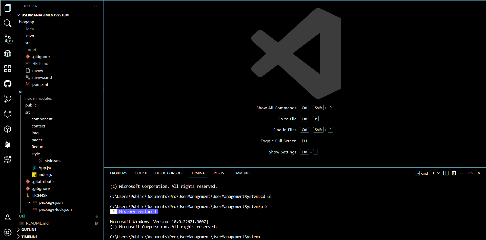
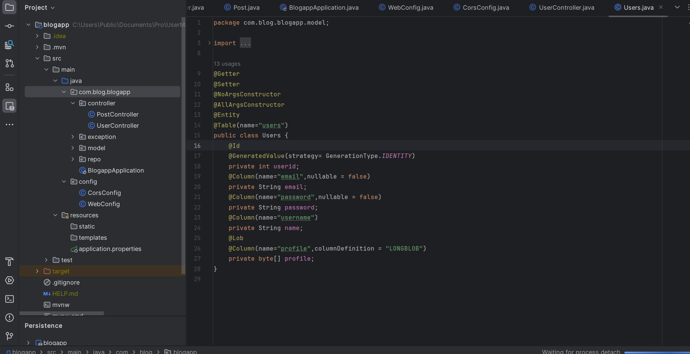
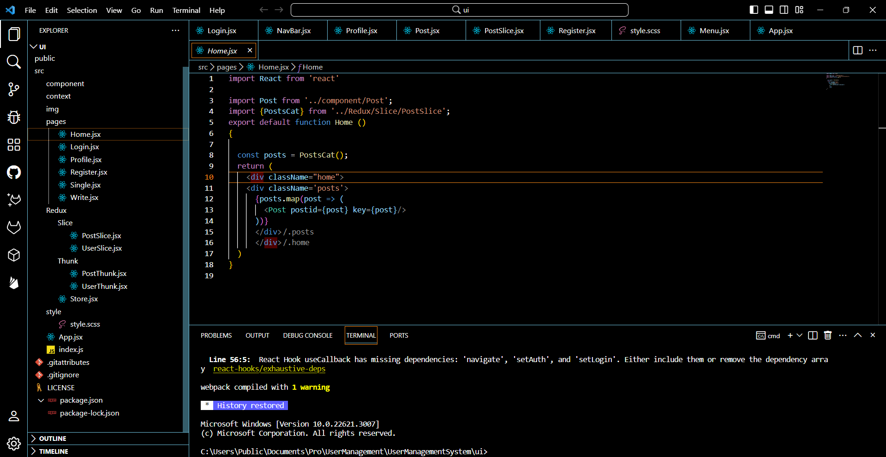

# Spring Boot and React.js Blog App

Welcome to the Spring Boot and React.js Blog App project! 🚀 This full-stack application combines the power of Spring Boot for the backend, React.js for the frontend, and Redux for state management.

## Project Overview

Briefly describe the purpose and key features of your Blog App. This section can include images or diagrams that give users a quick understanding of what your application does.

## Prerequisites

Ensure you have the following tools installed:

- Java
- Node.js
- IntelliJ IDEA Ultimate
- Visual Studio Code

## Getting Started

1. **Backend Setup (Spring Boot):**
   - Clone the repository.
   - Open the project in IntelliJ IDEA Ultimate.
   - Run the Spring Boot application.

2. **Frontend Setup (React.js with Redux):**
   - Navigate to the `frontend` directory.
   - Install dependencies: `npm install`.
   - Start the React.js application: `npm start`.

## Project Structure

Explain the organization of your project, detailing key directories and files. Provide a high-level overview of the structure to help users navigate the codebase.

## Backend Development

Discuss the backend architecture, key components, and any important concepts. Include code snippets to illustrate essential parts of the Spring Boot application.

## Frontend Development

Explain the structure of the React.js application, how Redux is integrated, and provide code examples for crucial components and actions.

## Integration of Backend and Frontend

Explain how the frontend communicates with the backend, showcasing any relevant code snippets and explaining the data flow.

## Testing

Discuss how to test different functionalities of your Blog App. Include information on testing frameworks or tools used.

## Contributions

Contributions are welcome! Please follow our [Contribution Guidelines](CONTRIBUTING.md) before submitting pull requests.

## License

This project is licensed under the [MIT License](LICENSE).

---

🚀 Happy coding! Feel free to reach out with any questions or feedback.
